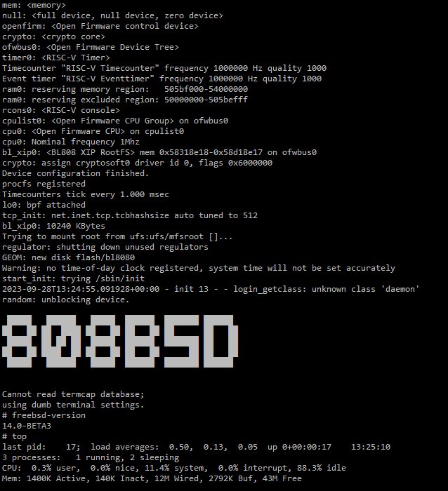

# FreeBSD IoT Project
The FreeBSD IoT Project is a research project that hopes to provide a business-friendly IoT standard solution based on FreeBSD's ultimate stability, security and complete ecology.

## Environment setup
Currently **ONLY** FreeBSD environment is supported. You can use software such as Virtual Box to install FreeBSD 13.2 or higher.

```
# pkg update
# pkg install git gmake liblz4 u-boot-tools riscv64-none-elf-gcc cmake
# git clone --recursive git@github.com:Virus-V/freebsd-bl808.git
# cd freebsd-bl808 
# ./crochet/crochet.sh -b Sipeed-M1s
```
BL808 FreeBSD firmware is in the `out` directory: `bl808_rtos_m0.bin` and `bl808_freebsd_d0.bin`
```
out
├── bl808_freebsd_d0.bin
└── bl808_rtos_m0.bin

1 directory, 2 files
```

## Download Firmware
1. Get the latest version of BouffaloLab DevCube from http://dev.bouffalolab.com/download
2. Follow the steps in the picture below:


After the burning is completed, reset the board and you can see the following log, which means FreeBSD is running successfully.



# TODOs
1. Adapt to the native serial port driver instead of using the functions provided by OpenSBI.
2. Enable net80211 wireless protocol stack (experimental)
3. Porting the LVGL graphics library.
4. Port rpmsg-lite to kernel and design rpmsg-lite bus driver. (Establish communication with RTOS core)

# License
BSD-3-Clause license 