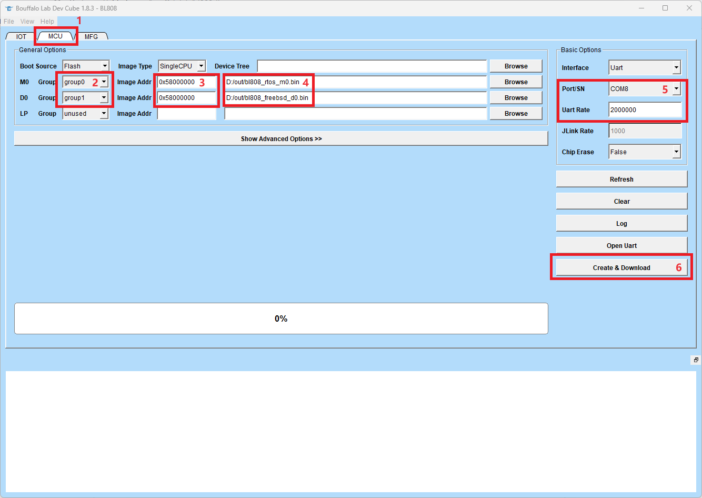

# FreeBSD IoT Project
The FreeBSD IoT Project is a research project that hopes to provide a business-friendly IoT standard solution based on FreeBSD's ultimate stability, security and complete ecology.

# Supported Boards
- [Sipeed M1s Dock](https://wiki.sipeed.com/hardware/zh/maix/m1s/m1s_dock.html)

## Quick Start
### Environment setup
Currently **ONLY** FreeBSD environment is supported. You can use software such as Virtual Box to install FreeBSD 13.2 or higher.

```
# pkg update
# pkg install git gmake liblz4 u-boot-tools riscv64-none-elf-gcc cmake ninja
# git clone --recursive git@github.com:Virus-V/freebsd-bl808.git
# cd freebsd-bl808
# gmake
```
*NOTE*: **FreeBSD requires root permissions to deploy rootfs, so the build process needs to be carried out with root permissions.**

BL808 FreeBSD firmware is in the `out` directory: `bl808_rtos_m0.bin` and `bl808_freebsd_d0.bin`
```
out
├── bl808_freebsd_d0.bin
└── bl808_rtos_m0.bin

1 directory, 2 files
```

### Build Customer Applications
The custom Application is located in the `apps` directory, and you can build it through the make tool. For example:
```bash
gmake apps/helloworld/install # build and deploy helloworld app
gmake apps/bsdinfo/install # build and deploy bsdinfo app

gmake #Repackage images
```

## Download Firmware
1. Get the latest version of BouffaloLab DevCube from http://dev.bouffalolab.com/download
2. Follow the steps in the picture below:



After the burning is completed, reset the board and you can see the following log, which means FreeBSD is running successfully.

```
C906 start...
mtimer clk:1000000
default config is: Sipeed_M1s
opensbi: /images/opensbi
kernel: /images/kernel
ramdisk: /images/root
fdt: /images/bl808.dtb
process OpenSBI - 0x3eff0000
process lz4 decompress FreeBSD kernel - 0x50000000
process Flattened Device Tree blob - 0x51ff8000
rootfs: <0x582d7bc0 0x260600>

load time: 430888 us

OpenSBI v0.6
   ____                    _____ ____ _____
  / __ \                  / ____|  _ \_   _|
 | |  | |_ __   ___ _ __ | (___ | |_) || |
 | |  | | '_ \ / _ \ '_ \ \___ \|  _ < | |
 | |__| | |_) |  __/ | | |____) | |_) || |_
  \____/| .__/ \___|_| |_|_____/|____/_____|
        | |
        |_|

Platform Name          : T-HEAD Xuantie c910
Platform HART Features : RV64ACDFIMSUVX
Platform Max HARTs     : 1
Current Hart           : 0
Firmware Base          : 0x3eff0000
Firmware Size          : 56 KB
Runtime SBI Version    : 0.2

MIDELEG : 0x0000000000000222
MEDELEG : 0x000000000000b1ff
---<<BOOT>>---
KDB: debugger backends: ddb
KDB: current backend: ddb
Physical memory chunk(s):
  0x50000000 - 0x53ffffff,    64 MB (  16384 pages)
Excluded memory regions:
  0x50000000 - 0x50578fff,     5 MB (   1401 pages) NoAlloc
Copyright (c) 1992-2023 The FreeBSD Project.
Copyright (c) 1979, 1980, 1983, 1986, 1988, 1989, 1991, 1992, 1993, 1994
        The Regents of the University of California. All rights reserved.
FreeBSD is a registered trademark of The FreeBSD Foundation.
FreeBSD 14.0-BETA3 #0 dev_bl808-n265147-abb2f0c50d8d-dirty: Thu Oct 12 13:28:21 CST 2023
    root@workstation:/home/virusv/work_nvme0/freebsd-bl808/crochet/work/obj/home/virusv/work_nvme0/freebsd-bl808/freebsd/src/riscv.riscv64/sys/GENERIC riscv
FreeBSD clang version 14.0.5 (https://github.com/llvm/llvm-project.git llvmorg-14.0.5-0-gc12386ae247c)
Preloaded elf kernel "kernel" at 0xffffffc00056f3a0.
SBI: OpenSBI v0.6
SBI Specification Version: 0.2
CPU 0  : Vendor=T-Head Core=Unspecified (Hart 0)
  marchid=0, mimpid=0
  MMU: 0x1<Sv39>
  ISA: 0x112d<Atomic,Compressed,Double,Float,Mult/Div>
  S-mode Extensions: 0
real memory  = 67108864 (64 MB)
Physical memory chunk(s):
0x0000000050579000 - 0x0000000053e85fff, 59822080 bytes (14605 pages)
avail memory = 56614912 (53 MB)
No static device mappings.
random: no preloaded entropy cache
random: no platform bootloader entropy
arc4random: WARNING: initial seeding bypassed the cryptographic random device because it was not yet seeded and the knob 'bypass_before_seeding' was enabled.
hostuuid: using 00000000-0000-0000-0000-000000000000
ULE: setup cpu 0
random: entropy device external interface
wlan: mac acl policy registered
wlan: <802.11 Link Layer>
mem: <memory>
null: <full device, null device, zero device>
openfirm: <Open Firmware control device>
crypto: <crypto core>
ofwbus0: <Open Firmware Device Tree>
timer0: <RISC-V Timer>
Timecounter "RISC-V Timecounter" frequency 1000000 Hz quality 1000
Event timer "RISC-V Eventtimer" frequency 1000000 Hz quality 1000
ram0: reserving memory region:   50579000-54000000
ram0: reserving excluded region: 50000000-50578fff
rcons0: <RISC-V console>
cpulist0: <Open Firmware CPU Group> on ofwbus0
cpu0: <Open Firmware CPU> on cpulist0
cpu0: Nominal frequency 1Mhz
bl_xip0: <BL808 XIP RootFS> mem 0x582d7bc0-0x585381bf on ofwbus0
crypto: assign cryptosoft0 driver id 0, flags 0x6000000
Device configuration finished.
procfs registered
Timecounters tick every 1.000 msec
lo0: bpf attached
tcp_init: net.inet.tcp.tcbhashsize auto tuned to 512
bl_xip0: 2433 KBytes
Trying to mount root from ufs:BL808/XIP0.uzip []...
regulator: shutting down unused regulators
GEOM: new disk BL808/XIP0
Warning: no time-of-day clock registered, system time will not be set accurately
start_init: trying /sbin/init
random: unblocking device.
2023-10-12T05:28:43.178372+00:00 - init 14 - - login_getclass: unknown class 'daemon'

  $$$$$$\       $$$$$$$$\ $$$$$$$\   $$$$$$\  $$$$$$$\
  \_$$  _|      \__$$  __|$$  __$$\ $$  __$$\ $$  __$$\
    $$ |  $$$$$$\  $$ |   $$ |  $$ |$$ /  \__|$$ |  $$ |
    $$ | $$  __$$\ $$ |   $$$$$$$\ |\$$$$$$\  $$ |  $$ |
    $$ | $$ /  $$ |$$ |   $$  __$$\  \____$$\ $$ |  $$ |
    $$ | $$ |  $$ |$$ |   $$ |  $$ |$$\   $$ |$$ |  $$ |
  $$$$$$\\$$$$$$  |$$ |   $$$$$$$  |\$$$$$$  |$$$$$$$  |
  \______|\______/ \__|   \_______/  \______/ \_______/

  The power to serve

#
```

# TODOs
1. Adapt to the native serial port driver instead of using the functions provided by OpenSBI.
2. Enable net80211 wireless protocol stack (experimental)
3. Porting the LVGL graphics library.
4. Port rpmsg-lite to kernel and design rpmsg-lite bus driver. (Establish communication with RTOS core)
5. Porting Matter - try my best ;)

# License
BSD-3-Clause license
